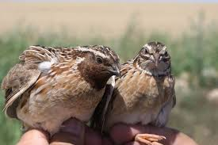

```{r setup, include=FALSE}
knitr::opts_chunk$set(echo = TRUE, warning=FALSE)
library(ggplot2)
library(knitr)
library(broom)
library(leaflet)
library(mapSpain)
```

# Introducción

En 2022, el equipo de investigación de Carles Vila publicó un artículo en el que se identificaba una **inversión de gran tamaño en el cromosoma 1 de la codorniz común (*Coturnix coturnix*)**, lo que daba lugar a dos morfotipos diferentes: uno sedentario con inversión y otro migratorio sin inversión.

El **morfotipo sedentario se encuentra geográficamente restringido al límite suroeste de la distribución de la especie**, incluyendo el sur de la Península Ibérica, el norte de África y los archipiélagos de la región de la Macaronesia [@illera_avian_2024]. Dentro de esta línea de investigación, surge la pregunta de si puede estar ocurriendo, como consecuencia del aislamiento geográfico, una diferenciación fenotípica entre las codornices sedentarias que residen permanentemente en el continente y las codornices sedentarias que residen permanentemente en los archipiélagos [@gavrilets_dynamics_2000].

Específicamente **en las Islas Canarias y en Madeira**, no queda claro si existe realmente un aislamiento geográfico, ya que **algunas codornices del morfotipo migratorio procedentes del continente son desviadas por los vientos y terminan llegando a las islas más orientales**.




Para conocer más información sobre la especie, dejamos el siguiente enlace a una [ficha hecha por SEO](https://seo.org/ave/codorniz-comun/).

```{r pkg, include=FALSE}
library(readxl)
library(dplyr)
library(ggplot2)

#Introduzco los datos con los que voy a trabajar
datos <- read_excel("Datos/datos_reproducibilidad.xlsx", sheet = 3)

```

# Metodología

## Área de estudio

El área de captura de machos de codorniz común comprendió varias localidades del sur de Europa, del norte de África y de la región de la Macaronesia. Estas quedan representadas en Figura \@ref(fig:mapa).


```{r mapa, echo=FALSE, fig.cap="Mapa de Europa y del norte de África con las localizaciones específicas donde se capturaron codornices comunes (C. coturnix) entre 2008 y 2019. Los puntos rojos representan las localizaciones correspondientes a isla, y los puntos azules las localizaciones correspondientes a continente."}

#Realizo un data.frame con las coordenadas de los puntos que corresponden a Isla
Isla <- data.frame(
  lng = c(-16.9241, -15.4363, -16.2518, -17.8879),
  lat = c(32.6669, 28.1235, 28.4636, 27.7620),
  popup = c("Madeira", "Gran Canaria", "Tenerife", "El Hierro")
)

#Realizo un data.frame con las coordenadas de los puntos que cooresponden a Cont.
Continente <- data.frame(
  lng = c(-7.5977, -6.3505, -7.6483, -6.6737),
  lat = c(33.1344, 32.3378, 37.1252, 37.3913),
  popup = c("El Gara", "Beni Mellal", "Tavira", "Escacena del Campo")
)

#Creo dos tipos de iconos diferentes para ponerle a cada uno de los conjuntos de puntos
icons1 <- awesomeIcons(
  icon = 'map-marker',
  iconColor = 'white',
  library = 'fa',
  markerColor = "red"
)

icons2 <- awesomeIcons(
  icon = 'map-marker',
  iconColor = 'white',
  library = 'fa',
  markerColor = "blue"
)

# Creo el mapa interactivo con leaflet()
leaflet() |> 
  addProviderEspTiles("IGNBase.Gris", group = "Base") |> 
  addProviderTiles("Esri.WorldImagery", 
                   group = "World Imagery (ESRI)",
                   options = providerTileOptions(maxZoom = 25)) |> 
  setView(lng = -15, lat = 30, zoom = 3) |>
addAwesomeMarkers(data = Isla, ~lng, ~lat, popup = ~popup, icon=icons1) |> 
addAwesomeMarkers(data = Continente, ~lng, ~lat, popup = ~popup, icon=icons2) |> 
  addLayersControl(
        position = "bottomright",
        baseGroups = c("World Imagery (ESRI)", "Base"),
        options = layersControlOptions(collapsed = TRUE) 
      ) 
  
```

## Toma de medidas

Los machos de codorniz común que se han utilizado en este estudio fueron capturados
entre los años 2008 y 2019, siempre durante la época reproductiva (marzo-junio). Para las capturas se empleó una red japonesa o de niebla, y se realizó como máximo un muestreo por semana, aunque no de manera constante. 

Ningún ave sufrió daño alguno durante la captura y manejo, los procedimientos se
ajustaron a las directrices y regulaciones institucionales y nacionales pertinentes en bioética. 

Para poner a prueba las tres hipótesis planteadas sobre la diversificación morfológica de las codornices, se midieron variables fenotípicas específicas relacionadas con los siguientes aspectos: (1) biometría, (2) nivel de grasa corporal y (3) estructura del aparato de vuelo. Las variables que se midieron y los valores promedios obtenidos se pueden consultar en Tabla \@ref(tab:tabla).


```{r tabla, echo=FALSE}
# Convertir resultados a un marco de datos
Tabla1 <- data.frame(Variables=c("Peso", "Longitud del tarso", "Longitud ala plegada", "Flancos", "Índice de Holynski", "Banda lipídica"), Valores_promedio_Continente=c(101, 33.52, 10.9, 1.58, 122, 1.88), Valores_promedio_Isla=c(100, 32.78, 10.9, 2, 121, 2.73))

# Mostrar los resultados
kable(Tabla1, caption = "Valores promedios de los datos recogidos en las localidades de Continente y en las localidades de Isla")
```

## Análisis estadístico

A continuación, se realizarán una serie de análisis para determinar si existen diferencias significativas entre las codornices insulares y las codornices continentales. Para ello, en primer lugar crearemos una columna en la que, según su origen, se clasifiquen en Isla o Continente. Por otro lado, nos interesa quedarnos solo con los individuos euring 5, es decir, adultos de dos años o más. Finalmente, filtraremos los datos para quedarnos, por un lado, con los indivuos con genotipo BB, y por otro lado, con genotipo AB; ya que ambos genotipos presentan la inversión.

```{r}
datos <- datos |> 
  mutate(Sitio = ifelse(loc1 %in% c("Marruecos", "Portugal", "Sevilla"), "Continente", "Isla"))

# Solo BB Eu5
datos_filtradosBB <- datos |> 
  filter(genotipo == "BB" & euring == 5)

# Solo AB Eu5
datos_filtradosAB <- datos |> 
  filter(genotipo == "AB" & euring == 5)

```

# Resultados

Una vez clasificado los datos, hemos podido realizar una serie de gráficas que comparan las codornices insuares y las continentales teniendo en cuenta disitntos carácteres que pueden estar relacionados con su estilo de vida. Por ejemplo, a continuación se muestra una gráfica de cajas y bigotes en la que se compara el peso de los individuos que están en Isla y en Continente.

```{r gráfica, echo=FALSE, warning=FALSE,fig.cap="Diferencias en la longitud máxima del tarso entre individuos procedentes de las islas y del continente"}

# Con el comando siguiente, realizo un boxplot (gráfica de cajas y bigotes) que compara el peso de los individuos BB (euring 5) que están en isla y en continente.
ggplot(datos_filtradosBB, aes(x = Sitio, y = peso, fill = Sitio)) +
  geom_boxplot(outlier.colour = NA, notch = FALSE, color = "black", width = 0.6) +  # bordes negros
  geom_point(aes(group = Sitio), 
             position = position_jitterdodge(dodge.width = 0.75, jitter.width = 0.2), 
             linewidth = 2) +
  scale_fill_manual(values = c("Continente" = "tomato", "Isla" = "#836EFF")) +
  labs(title = "Comparación del peso entre Continente e Isla, BB Eu5",
       x = "Sitio", y = "Peso") +
  theme_minimal() +
  theme(
    axis.line = element_line(linewidth = 0.7),
    axis.ticks = element_line(linewidth = 0.7),
    axis.text = element_text(linewidth = 10),
    axis.title = element_text(linewidth = 12, face = "bold"),
    plot.title = element_text(linewidth = 10, face = "bold"),
    legend.position = "none",
    panel.grid.major = element_blank(),  
    panel.grid.minor = element_blank()
  )

```


# Referencias


